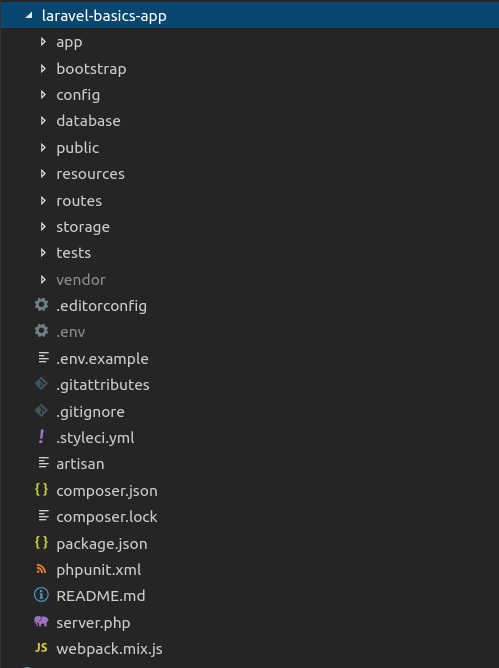

# Laravel Application structure 
The following image showing the structure of a laravel project
 

 
Following folders are there in laravel structure
## App
It is the application folder and it includes the entire source code of the project.
*The App folder comprise various sub folders as explained below* -
* **Console** :- It includes the artisan commands necessary for Laravel.
* **Exceptions** :- This folder contains all the methods needed to handle exceptions. It also contains the file handler.php that handle all the exceptions.
* **Http** :- As Laravel follows the MVC design pattern, this folder includes *model, controllers and views* defined for the specific directories. The Http folder has the following subfolders:-
    * **Middileware** :-  
