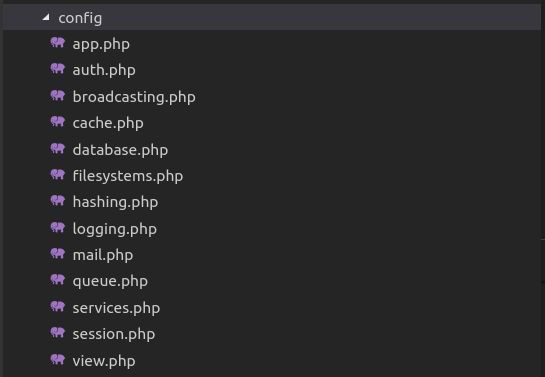
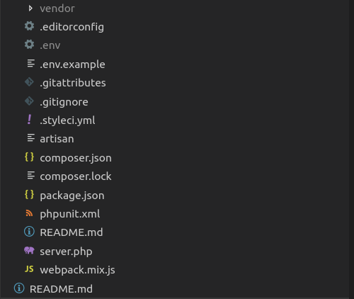

# Laravel Application structure 
The following image showing the structure of a laravel project
 

 
Following folders are there in laravel structure
## app
It is the application folder and it includes the entire source code of the project.
*The App folder comprise various sub folders as explained below* -
* **Console** :- It includes the artisan commands necessary for Laravel.
* **Exceptions** :- This folder contains all the methods needed to handle exceptions. It also contains the file handler.php that handle all the exceptions.
* **Http** :- As Laravel follows the MVC design pattern, this folder includes *model, controllers and views* defined for the specific directories. The Http folder has the following subfolders:-
    * **Middileware** :- This folder includer middleware mechanism, comprising the filter mechanism and communication between response and request.
    * **Controllers** :- Will have the list of controllers.
* **Providers** :- This folder includes all the service providers required to register events for core servers and to configure a Laravel application.
## bootstrap
It will have all the application bootstrap scripts. It contains a sub-folder namely **cache**, which includes all the files associated for caching a web application. It will also have a file **app.php**, which initializes the scripts necessary for bootstrap.
## config
The config folder includes various configurations for the application database, queue and session etc.
It have the configuration file which helps to defined the centralized configuration for our application.
Following structure for the laravel is given in below image.

## database 
As it names resembles , this directory includes various parameters for database functionalties. It includes three sub-directories as given below -
* **seeds** - This will help to seed the testing data in our DB.
* **migrations** - This folder helps to build up the structure of tables for our application.
* **factories** - This folder is used to generate large number of data records.
## public 
It is the main folder which helps in initializing the Laravel application. It includes the following files and folders-
* **.htaccess** :- It will give the server configuration.
* **javascript and css** :- These files are considered as assets.
* **index.php** :- This will intialize our web application.
## resources
Resources directory contains the files which enhances our web application. It have the following sub-folders 
* **assets** :- It include files such as LESS and SCSS, that are required for styling the web application.
* **lang** :- This folder includes configuration for localization and internalization.
* **views** :- View are the HTML files or templates which interact with end users and it is a primary part of a MVC architecture.
## routes
It will have our application routes.
## storage
This is the folder that stores all the logs and necessary files which are needed frequently when a Laravel project is running. . It have the following sub-folders
* **app** :- This will have the files that are called in succession.
* **framework** :- It contains sessions, cache and views which are called frequently.
* **logs** :- All exceptions and error logs are tracked in this sub folder.
## tests
All the unit test cases are included in this directory and the naming convention for test case for classes is camel_case and follow the convention as per the functionality of the class.
## vendor
Laravel is completely based on Composer dependencies, for example to install Laravel setup or to include third party libraries, etc. The Vendor folder includes all the composer dependencies.

In addition to the above mentioned files, Laravel also includes some other files which play a primary role in various functionalities such as **GitHub configuration, packages and third party libraries**.
The files included in the application structure are shown below −

	<a href ="https://github.com/satish-dev/laravel-basics/blob/master/documentation/Installation.md" >Previous (Introduction)</a>
	&nbsp;&nbsp;&nbsp;&nbsp;&nbsp;&nbsp;&nbsp;&nbsp;&nbsp;&nbsp;&nbsp;&nbsp;&nbsp;
	&nbsp;&nbsp;&nbsp;&nbsp;&nbsp;&nbsp;&nbsp;&nbsp;&nbsp;&nbsp;&nbsp;&nbsp;&nbsp;
	&nbsp;&nbsp;&nbsp;&nbsp;&nbsp;&nbsp;&nbsp;&nbsp;&nbsp;&nbsp;&nbsp;&nbsp;&nbsp;
	&nbsp;&nbsp;&nbsp;&nbsp;&nbsp;&nbsp;&nbsp;&nbsp;&nbsp;&nbsp;&nbsp;&nbsp;&nbsp;
    &nbsp;&nbsp;&nbsp;&nbsp;&nbsp;&nbsp;&nbsp;&nbsp;&nbsp;&nbsp;&nbsp;&nbsp;&nbsp;
	&nbsp;&nbsp;&nbsp;&nbsp;&nbsp;&nbsp;&nbsp;&nbsp;&nbsp;&nbsp;&nbsp;&nbsp;&nbsp;
	&nbsp;&nbsp;&nbsp;&nbsp;&nbsp;&nbsp;&nbsp;&nbsp;&nbsp;&nbsp;&nbsp;&nbsp;&nbsp;
	&nbsp;&nbsp;&nbsp;&nbsp;&nbsp;&nbsp;&nbsp;&nbsp;&nbsp;&nbsp;&nbsp;&nbsp;&nbsp;
	<a href =https://github.com/satish-dev/laravel-basics/blob/master/documentation/Configuration.md" >Next (Laravel - Configuration)</a> 

