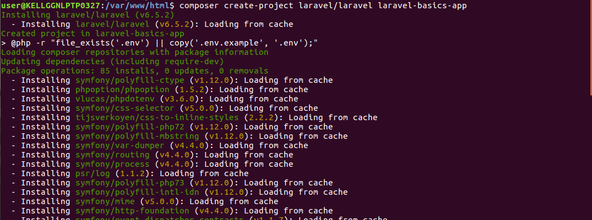

# Installation
In order to manage the dependencies laravel uses the composer.Make sure you have composer installed in your system before you starts the actual installation for laravel.
Let's see the installation process of laravel
## Step 1 
Download the composer from it's official site
```
https://getcomposer.org/download/
```
## Step 2 
Install the composer in your machine by following the appropriate steps. Now check whether the composer is installed or not by typing *composer*
```
composer
```
You will see the below output on your terminal

## Step 3
Move to any folder location in system and from there type the below command to install the laravel
```
composer create-project laravel/laravel laravel-basics-app
```
The output of the command is as shown below −

## Step 4
After installing the *laravel-application* with above command it's the time to serve it by using the below command
```
php artisan serve --host=0.0.0.0 --port=8080
```
Where **--host* will define the host and *--port* will define the port no that has to be used.
The output of the command is as shown below −

If we will copy the above URL higlighted in White in the above screenshot and open that URL in the browser and seeing the following screen then it means Laravel application has installed successfully.

<div>
	<span><a href ="https://github.com/satish-dev/laravel-basics/blob/master/documentation/Introduction.md" >Previous (Introduction)</a></span>
	&nbsp;&nbsp;&nbsp;&nbsp;&nbsp;&nbsp;&nbsp;&nbsp;&nbsp;&nbsp;&nbsp;&nbsp;&nbsp;
	&nbsp;&nbsp;&nbsp;&nbsp;&nbsp;&nbsp;&nbsp;&nbsp;&nbsp;&nbsp;&nbsp;&nbsp;&nbsp;
	&nbsp;&nbsp;&nbsp;&nbsp;&nbsp;&nbsp;&nbsp;&nbsp;&nbsp;&nbsp;&nbsp;&nbsp;&nbsp;
	&nbsp;&nbsp;&nbsp;&nbsp;&nbsp;&nbsp;&nbsp;&nbsp;&nbsp;&nbsp;&nbsp;&nbsp;&nbsp;
    &nbsp;&nbsp;&nbsp;&nbsp;&nbsp;&nbsp;&nbsp;&nbsp;&nbsp;&nbsp;&nbsp;&nbsp;&nbsp;
	&nbsp;&nbsp;&nbsp;&nbsp;&nbsp;&nbsp;&nbsp;&nbsp;&nbsp;&nbsp;&nbsp;&nbsp;&nbsp;
	&nbsp;&nbsp;&nbsp;&nbsp;&nbsp;&nbsp;&nbsp;&nbsp;&nbsp;&nbsp;&nbsp;&nbsp;&nbsp;
	&nbsp;&nbsp;&nbsp;&nbsp;&nbsp;&nbsp;&nbsp;&nbsp;&nbsp;&nbsp;&nbsp;&nbsp;&nbsp;
	<span><a href ="https://github.com/satish-dev/laravel-basics/blob/master/documentation/ApplicationStructure.md" >Next (Application structure)</a> </span>
</div>
