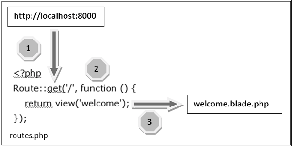

# Routing
All the application routes are registered within the *app/routes/* folder. Under this folder there are following files:-
* **api.php**:- Here is where you can register API routes for your application.
* **channels.php** :- Here you may register all of the event broadcasting channels that your application supports.
* **console.php** :- This file is where you may define all of your Closure based console commands.
* **web.php** :- Here is where you can register web routes for your application.

*Routing* in laravel includes the following categories-
* **Basic Routing**
* **Route Parameters**
* **Named Parameters**
## Basic Routing
Let's understand the basic routing with the example:-
Go to **app/routes/web.php**
You will have the following code in that
'''
Route::get('/', function () {
    return view('welcome');
});
'''
Above route will load the **resources/view/welcome.blade.php**, and this will help us in displaying our welcome page.
Let us now see how the routing works
* Step-1 :- Initially, we should execute the root URL of the application.
* Step-2 :- Now the executed URL must match the url available in *web.php*.
* Step-3 :- The function calls the template file which is in *resources/view/welcome.blade.php*.
Below image will have the concept how the routing works

## Route Parameters
Sometimes you will need to capture the parameters from the URL.For this we could have the following two types of parameter.
* **Required Parameters**:- If we have the mandatory params in that case we can use the Required Parameters.Example:-
```
Route::get('ID/{id}',function($id) {
   echo 'ID: '.$id;
});
```
* **Optional parameters** :- Sometimes we have the optional parameters for route in that case we can use the following example
```
// Optinal parameters
Route::get('user/{name?}',function ($name = 'Laravel -Basics') 
{ return $name;});
```
## Named Routes
Named routes is really helpful while the time of re-using it.
Following is the example of named routes:-
```
Route::get('user/profile', 'UserController@showProfile')->name('profile');
```
<div>
	<span><a href ="https://github.com/satish-dev/laravel-basics/blob/master/documentation/Configuration.md" >Previous (Configuration)</a></span>
	&nbsp;&nbsp;&nbsp;&nbsp;&nbsp;&nbsp;&nbsp;&nbsp;&nbsp;&nbsp;&nbsp;&nbsp;&nbsp;
	&nbsp;&nbsp;&nbsp;&nbsp;&nbsp;&nbsp;&nbsp;&nbsp;&nbsp;&nbsp;&nbsp;&nbsp;&nbsp;
	&nbsp;&nbsp;&nbsp;&nbsp;&nbsp;&nbsp;&nbsp;&nbsp;&nbsp;&nbsp;&nbsp;&nbsp;&nbsp;
	&nbsp;&nbsp;&nbsp;&nbsp;&nbsp;&nbsp;&nbsp;&nbsp;&nbsp;&nbsp;&nbsp;&nbsp;&nbsp;
    &nbsp;&nbsp;&nbsp;&nbsp;&nbsp;&nbsp;&nbsp;&nbsp;&nbsp;&nbsp;&nbsp;&nbsp;&nbsp;
	&nbsp;&nbsp;&nbsp;&nbsp;&nbsp;&nbsp;&nbsp;&nbsp;&nbsp;&nbsp;&nbsp;&nbsp;&nbsp;
	&nbsp;&nbsp;&nbsp;&nbsp;&nbsp;&nbsp;&nbsp;&nbsp;&nbsp;&nbsp;&nbsp;&nbsp;&nbsp;
	&nbsp;&nbsp;&nbsp;&nbsp;&nbsp;&nbsp;&nbsp;&nbsp;&nbsp;&nbsp;&nbsp;&nbsp;&nbsp;
	<span><a href ="https://github.com/satish-dev/laravel-basics/blob/master/documentation/Middleware.md" >Next (Middleware)</a> </span>
</div>